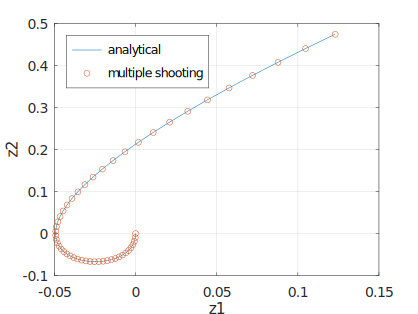

## Optimal control problem

Consider the optimal control problem for a cart system taken from Ref. [^1]. The variables in problem are defined as follows.

1. $z_1$ - position of the cart
2. $z_2$ - velocity of the cart
3. $f$ - force applied to the cart

The cart starts from rest and the final position is dependent on the velocity of the cart at final time. There is also a drag force which slows the cart and the optimal control
problem seeks the control action which minimizes control effort while respecting the constraints.

$$
\begin{gathered}
\text{min.}~~\int_{0}^{2}f^2dt\\
\frac{d}{dt}\begin{bmatrix}
z_1\\
z_2
\end{bmatrix}=
\begin{bmatrix}
z_2\\
-z_2+f
\end{bmatrix}\\
\begin{bmatrix}
z_1\\
z_2
\end{bmatrix}(0)=
\begin{bmatrix}
0\\
0
\end{bmatrix}\\
z_1(2)-2.694528z_2(2)+1.155356=0
\end{gathered}
$$

## Analytical solution
Pontrygin's minimization principle leads to the following analytical solution for the objective, states and control.

$$
\begin{aligned}
\mathrm{Obj.}&=0.577678\\
z_{1}(t)&=\frac{-3}{8}e^{-t}+\frac{1}{8}e^{t}-\frac{t}{2}+\frac{1}{4}\\
z_{2}(t)&=\frac{3}{8}e^{-t}+\frac{1}{8}e^{t}-\frac{1}{2}\\
f(t)&=\frac{1}{4}e^{t}-\frac{1}{2}\\
\end{aligned}
$$

## Numerical methods for optimal control
The sample codes demonstrate direct methods [^2], a class of methods used to solve optimal control problems numerically. The time domain, objective functional and the constraints are discretized and transformed to a nonlinear optimization problem. The solution of the optimization problem comprise the optimal discrete state and control vector.

### Numerical methods implemented
|method|control parameterization|files|
|-|-|-|
|trapezoidal piecewise | piecewise constant control|```trapezoidal_constant.m```|
|Hermite Simpson |piecewise linear control|```simpson.m```|
|Runge Kutta 4 (single shooting) | piecewise constant control|```single_shooting.m```|
|Runge Kutta 4 (multiple shooting) | piecewise constant control|```multiple_shooting.m```|
|Legendre Gauss Lobatto [^3]|global polynomial|```LGL pseudospectral.m, legslb.m, legslbdiff.m, lepoly.m, lepolym.m```|

## Results

Numerical and analytical results compared side by side.




## Implementation

The code are available in both python, octave or matlab for use.

### MATLAB/OCTAVE
- MATLAB/[OCTAVE-6.1.0](https://octave.org/)
- [Casadi 3.5.5](https://web.casadi.org/)

### python

#### Requirements
- python ^3.11
- casadi 3.6.5
- matplotlib
- numpy ^1.26.4

* The jupyter notebooks for all the methods are available in the python folder. 
* ```lglpsmethods.py```- module which generates the differentiation matrix, quadrature and nodes for pseudospectral methods.

# References

[^1]: Conway, B. A. and K. Larson (1998). Collocation versus differential inclusion in direct optimization. Journal of Guidance, Control, and Dynamics, 21(5), 780–785
[^2]: Diehl, Moritz, and Sébastien Gros. "Numerical optimal control." Optimization in Engineering Center (OPTEC) (2011).
[^3]: Shen, Jie, Tao Tang, and Li-Lian Wang. Spectral methods: algorithms, analysis and applications. Vol. 41. Springer Science & Business Media, 2011.
